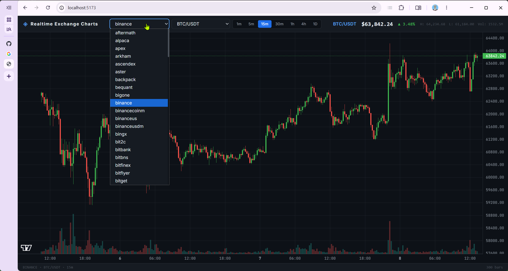

# Realtime Exchange Charts

An experimental proof-of-concept exploring the integration of **[ccxt](https://github.com/ccxt/ccxt)** and **[lightweight-charts](https://github.com/tradingview/lightweight-charts)**.

> **Not intended for trading or production use.**
> This is an educational project. Commits may introduce breaking changes without notice.

---

## Preview

<video src="https://github.com/user-attachments/assets/51853e03-47e9-4a7f-9d87-fae465e01da9" controls width="720"></video>



## What it does

Renders live candlestick charts for cryptocurrency pairs fetched from any exchange supported by ccxt. Users can switch exchange, trading pair, and timeframe on the fly.

## Architecture

```
src/
├── server/                  Express API (Node.js + ccxt)
│   ├── routes/market.ts     /api/market/{exchanges,pairs,ohlcv,ticker}
│   └── services/exchange.ts ccxt exchange factory
└── client/                  React + Vite frontend
    ├── context/
    │   └── LoadingContext   Global loading state (push/pop stack)
    ├── config/
    │   └── loadingMessages  Dictionary: loading event keys → UI strings
    ├── hooks/
    │   ├── useExchanges     Fetches available exchanges
    │   ├── useExchangePairs Fetches USDT spot pairs for selected exchange
    │   └── useMarketData    Fetches OHLCV + ticker, polls every 5s
    ├── test/                Vitest characterization tests (client only)
    │   ├── mocks/           MSW handlers for all four API endpoints
    │   └── hooks/           Tests for useExchanges, useExchangePairs, useMarketData
    └── ui/
        └── components/
            ├── Spinner            Reads from LoadingContext — decoupled from API layer
            ├── Chart              lightweight-charts candlestick + volume
            ├── PriceDisplay       Live ticker (last price, change, H/L/Vol)
            ├── ExchangeSelect     Exchange picker
            ├── PairSelect         Trading pair picker
            ├── IntervalSelector   Timeframe picker
            └── ErrorBanner        Inline error display
```

The loading state follows a middleware pattern: hooks announce what they are doing by pushing typed entries (`FETCHING_PAIRS`, `FETCHING_MARKET_DATA`, …) to `LoadingContext`. The `Spinner` component resolves those keys through `loadingMessages.ts` — neither the spinner nor the hooks need to know about each other.

When switching exchanges the pair select resets immediately, blocking any API call until the new exchange's pairs are resolved. The previous symbol is restored if available on the new exchange; otherwise the first pair is selected.

## Testing

20 characterization tests covering the three data hooks (`useExchanges`, `useExchangePairs`, `useMarketData`). They capture current behaviour — OHLCV/ticker mapping, loading flags, 5 s polling, error paths, stale-response cancellation — and act as a regression net for the planned `services/` layer refactor.

API calls are intercepted by [MSW](https://mswjs.io/) v2, so no running backend is required.

```bash
# Run once
docker-compose run --rm realtime_exchange_charts npm test

# Watch mode
docker-compose run --rm realtime_exchange_charts npm run test:watch
```

See [`docs/TESTING.md`](docs/TESTING.md) for full details.

## Stack

| Layer | Technology |
|---|---|
| Exchange data | [ccxt](https://github.com/ccxt/ccxt) |
| Charting | [lightweight-charts](https://github.com/tradingview/lightweight-charts) v4 |
| Frontend | React 18, TypeScript, Vite |
| Backend | Express, Node.js (ESM) |
| Styling | Tailwind CSS |
| Container | Docker + Docker Compose |

## Running locally

> **WSL2 note:** development and testing were done exclusively under WSL2 on Windows. Behaviour outside WSL2 has not been verified.

### With Docker Compose (recommended)

```bash
docker compose up --build
```

Frontend → `http://localhost:5173`  
API → `http://localhost:3001`


Requires Node.js ≥ 20.

## Disclaimer

This project exists to explore library APIs and rendering patterns. It is not financial software. Do not use it to make trading decisions.

MIT License

Copyright (c) 2026 Patrycjusz Marciniak

Permission is hereby granted, free of charge, to any person obtaining a copy
of this software and associated documentation files (the "Software"), to deal
in the Software without restriction, including without limitation the rights
to use, copy, modify, merge, publish, distribute, sublicense, and/or sell
copies of the Software, and to permit persons to whom the Software is
furnished to do so, subject to the following conditions:

The above copyright notice and this permission notice shall be included in all
copies or substantial portions of the Software.

THE SOFTWARE IS PROVIDED "AS IS", WITHOUT WARRANTY OF ANY KIND, EXPRESS OR
IMPLIED, INCLUDING BUT NOT LIMITED TO THE WARRANTIES OF MERCHANTABILITY,
FITNESS FOR A PARTICULAR PURPOSE AND NONINFRINGEMENT. IN NO EVENT SHALL THE
AUTHORS OR COPYRIGHT HOLDERS BE LIABLE FOR ANY CLAIM, DAMAGES OR OTHER
LIABILITY, WHETHER IN AN ACTION OF CONTRACT, TORT OR OTHERWISE, ARISING FROM,
OUT OF OR IN CONNECTION WITH THE SOFTWARE OR THE USE OR OTHER DEALINGS IN THE
SOFTWARE.